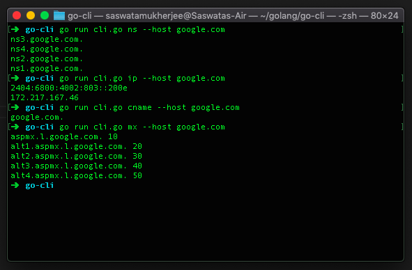

# Go WebLookup CLI
A simple CLI written in Go which lets you query IPs, CNAMEs, MX records and name servers for a particular host.

## Usage
NAME:
   WebLookup CLI - Lets you query IPs, CNAMEs, MX records and name servers!

USAGE:
   cli [global options] command [command options] [arguments...]

COMMANDS:
   ns       Looks up the name servers for a Particular Host
   ip       Looks up the IP addresses for a particular host
   cname    Looks up the CNAME for a particular host
   mx       Looks up the MX Records for a particular host
   help, h  Shows a list of commands or help for one command

GLOBAL OPTIONS:
   --help, -h  show help

## Example

## To Run
- Clone into repo
- Run `go get github.com/urfave/cli`
- Run `go run cli.go` to view usage or `go build cli.go`

